# socket.io android & vue enable https client demo

I will develop more functions if I have time   

1. install released apk in you phone: [release](https://github.com/intbird/SocketIOControl-Android/releases)  
2. open the website(chrome) : [https://intbird.net/#/socket.io/](https://intbird.net/#/socket.io/)
3. click app button 'start server' connect to the server

4. you can see the wss connnection in `charles app`
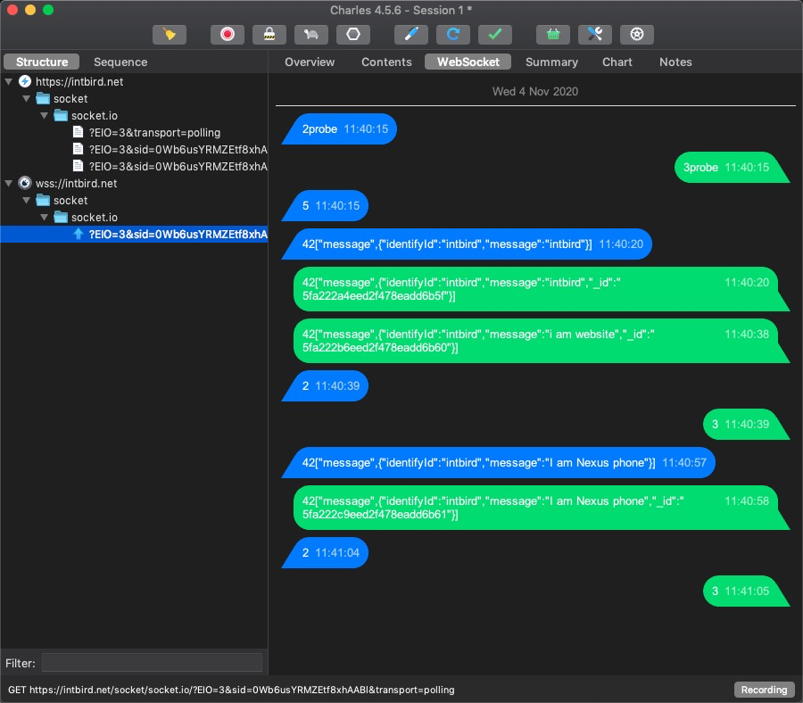

------

# 1. website:
 https://intbird.net/

## 2. socket web url :
   https://intbird.net/#/socket.io/

## 3. socket server path:
   https://intbird.net/socket/

## 4. server github:
[socketiocontrol-server](https://github.com/intbird/SocketIOControl-Server)

# key function
###### 1. phone send message to pc or pc send message to phone
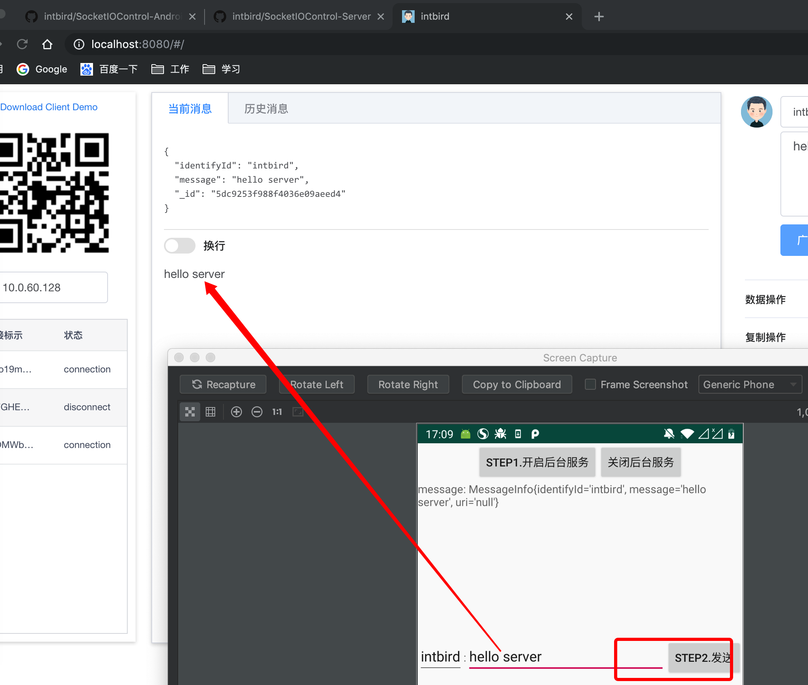

###### 2. push text to phone clipboard or get phone clipboard
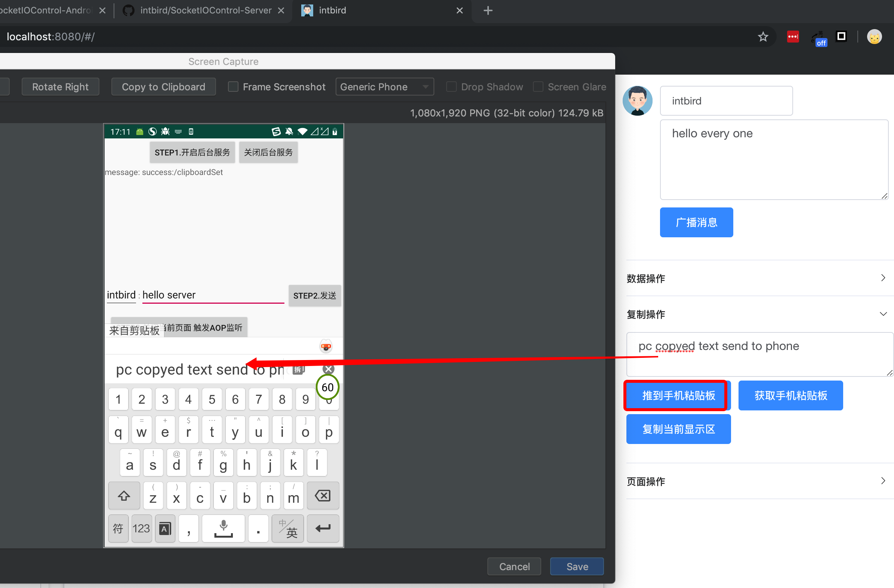

###### 3. developing...
such as use MQ to send message queue ...
new repo:
[https://github.com/intbird/intbird](https://github.com/intbird/intbird)

--------

###### 4. screen shots
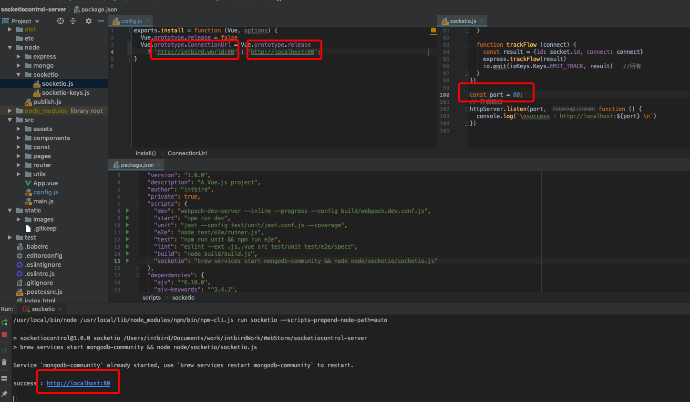
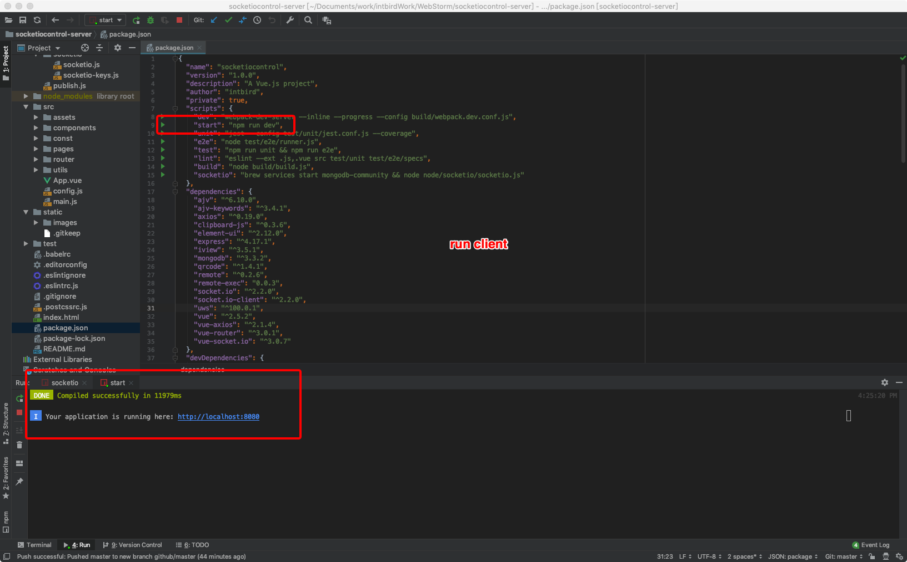
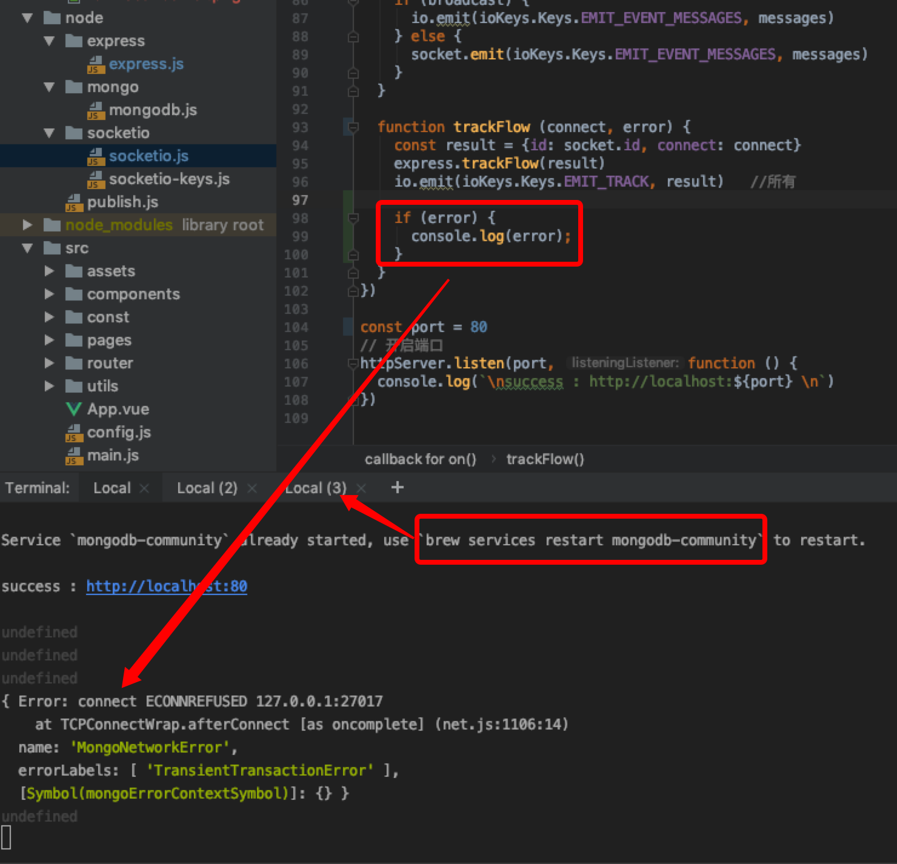
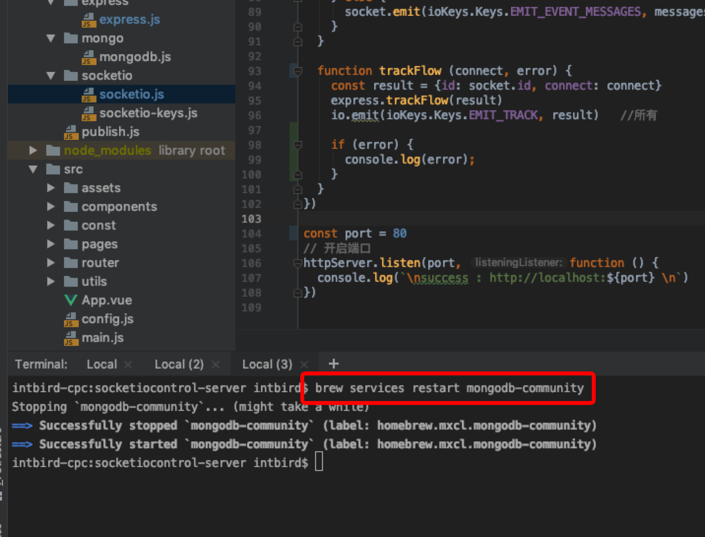

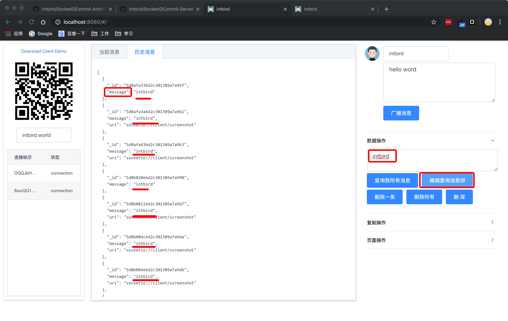
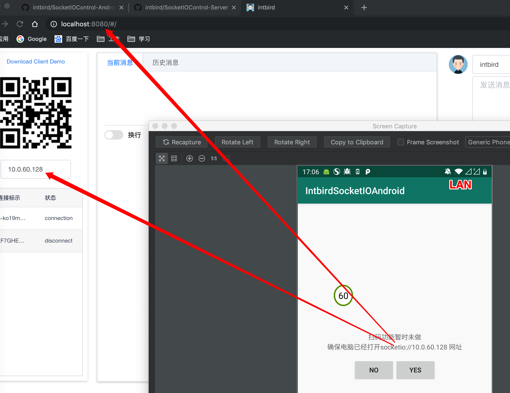
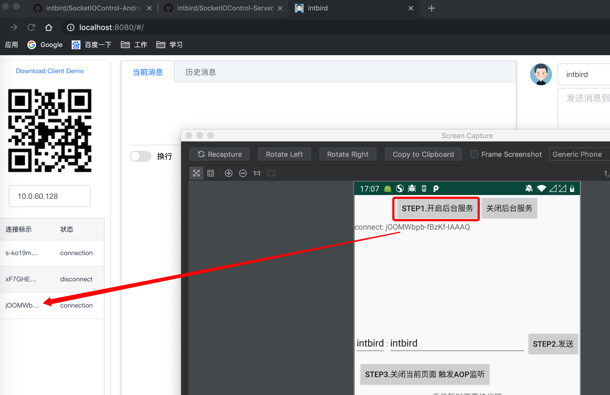
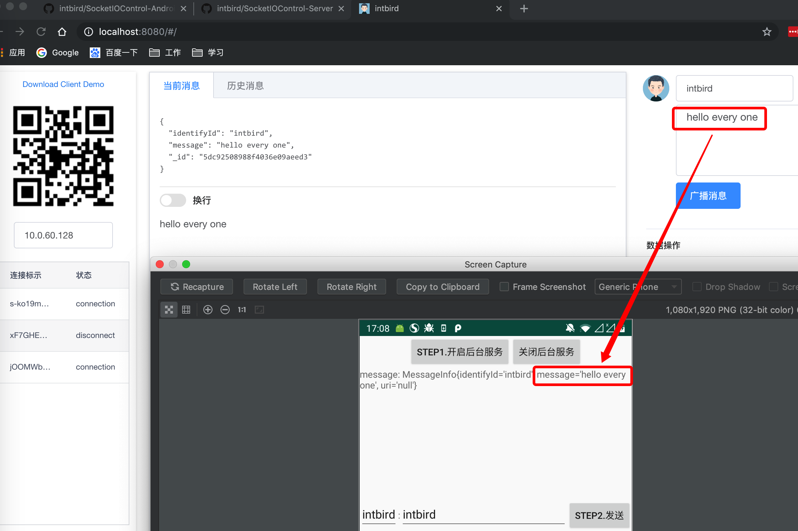

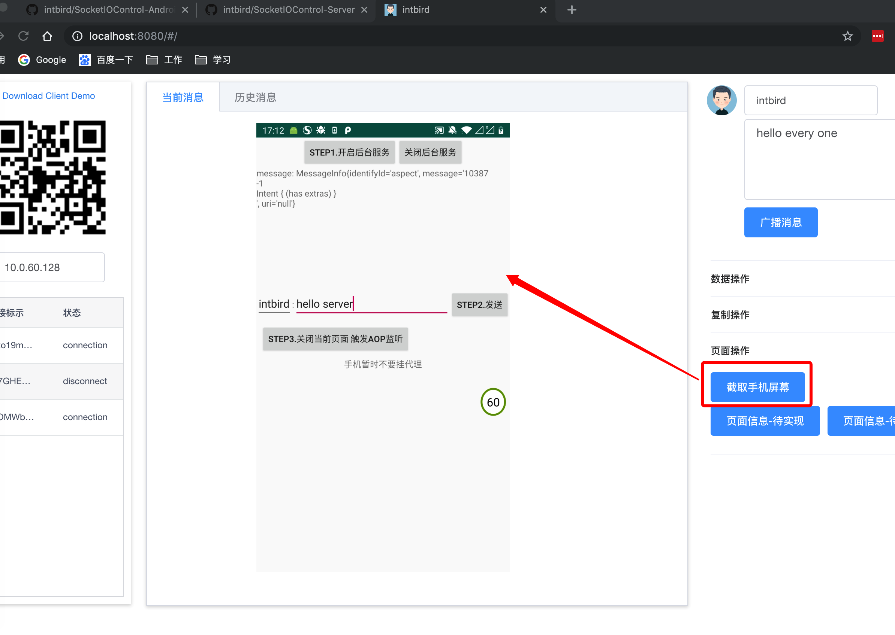

